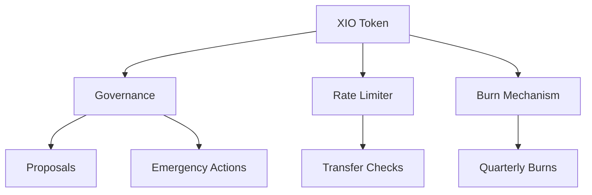

# XIO Token System Architecture

## Overview

The XIO Token system is a comprehensive token and governance platform built on Base and designed to integrate with Hyperliquid L1. The system consists of several key components working together to provide token functionality, governance capabilities, and security features.

## Core Components

### 1. XIO Token Contract (XIO.sol)

The main token contract implementing:
- ERC20 standard functionality
- Rate limiting for transfers
- Quarterly burn mechanics
- Role-based access control
- Emergency control mechanisms

Key Features:
```solidity
- Initial Supply: 1,000,000,000 tokens
- Max Burn: 50% of total supply
- Quarterly Burn Interval: 90 days
- Rate Limiting: Configurable amount/period
```

### 2. Governance System (XIOGovernance.sol)

Handles all governance-related functionality:
- Proposal creation and execution
- Emergency action management
- Token-holder voting
- Parameter updates

Key Parameters:
```solidity
- Execution Delay: 2 days
- Execution Window: 5 days
- Configurable quorum and proposal thresholds
```

## System Integration

### Token Flow
1. Token transfers subject to rate limiting
2. Quarterly burns executed by authorized roles
3. Governance proposals affect token parameters
4. Emergency system provides safety controls

### Role Hierarchy
```
DEFAULT_ADMIN_ROLE
├── PAUSER_ROLE
├── MINTER_ROLE
├── BURNER_ROLE
├── OPERATOR_ROLE
└── GOVERNANCE_ROLE
```

## Security Features

1. Rate Limiting
   - Prevents large-scale token dumps
   - Configurable parameters
   - Exemption list for trusted addresses

2. Emergency Controls
   - Emergency mode activation
   - 24-hour action delay
   - Recovery address system

3. Governance Safeguards
   - Multi-signature requirements
   - Timelock on executions
   - Value restrictions

## Network Architecture

### Base Network Deployment
- Main token functionality
- Core governance operations
- User interactions

### Hyperliquid L1 Integration
- Cross-chain operations
- Liquidity provision
- Trading functionality

## Contract Interactions



## Upgrade Path

While the current contracts are not upgradeable, future upgrades can be implemented through:
1. Governance proposals for parameter changes
2. Emergency system for critical updates
3. New contract deployments with migration paths

## Development and Testing

Key development aspects:
- Hardhat development environment
- Comprehensive test suite
- Automated deployment scripts
- Monitoring and alerting system

## Integration Points

1. Frontend Integration
   - Web3 interaction methods
   - Event monitoring
   - Transaction handling

2. Backend Services
   - Block monitoring
   - Transaction tracking
   - Rate limit tracking

3. External Systems
   - Snapshot integration
   - Hyperliquid bridge
   - Monitoring services

## System Constraints

### Rate Limiting
```solidity
transferredInPeriod[user] + amount <= rateLimitAmount
```

### Burn Limits
```solidity
totalBurned + amount <= MAX_BURN_SUPPLY
block.timestamp >= lastQuarterlyBurn + QUARTERLY_BURN_INTERVAL
```

### Governance Timing
```solidity
executionTime = block.timestamp + EXECUTION_DELAY
deadline = executionTime + EXECUTION_WINDOW
```